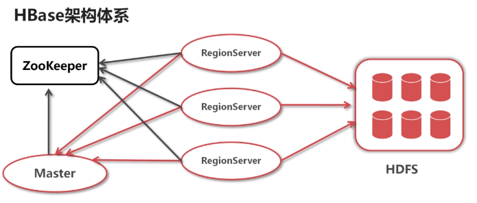
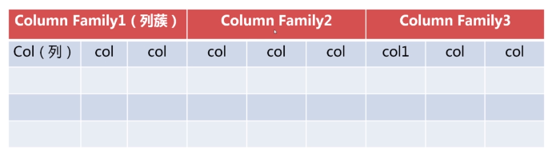

##### 如何选择合适的HBase版本 #####
通常不选择最新的。因为HBase作为一个开源项目，最新的版本都是不稳定的。HBase有官网版本，
CDH版本。其中CDH版本是cloudera公司对官网版本的一个优化或者整合，目的是稳定性，
对不同技术的兼容性做了考虑。现实中，更多的是使用CDH版本。

官网版本下载地址：http://archive.apache.org/dist/hbase/
CDH版本下载地址：http://archive.cloudera.com/cdh5/cdh/5/

下载CDH版本的HBase，如果还需要使用到Hadoop以及其他。那么也要选择对应的CDH版本。

##### HBase架构体系 #####

HBase有两个主要的进程。一个是RegionServer，一个是Master。
* RegionServer可以理解为DataNote（主要用来存储数据）。
* Master主要是用来管理RegionServer。RegionServer需要时时的报告自身的健康状态信息到Master，还需要告诉Master自己管理了哪些region（相当于数据分区）。
ZooKeeper在这的作用和Master相当。
HBase依赖于两个服务。ZooKeeper主要在分布式场景中负责协调。HBase最终存储的数据在HDFS。所以安装HBase需要先安装Zookeeper和HDFS。

##### HBase表结构模型 #####

在HBase中，主要是表的列蔟。列蔟是指对所有的列进行分类。而列蔟之下是动态的列。对应
java来说就是一行中，存储了不同的对象（其实就是列蔟），这个对象的属性
（其实就是具体的列）是动态的。一张表的列蔟不会超过五个。列只有插入数据后才存在。
列在列蔟中是有序的。

##### HBase监控WEB页面 #####

默认端口60010。参考url地址： http://ip:60010/

##### Base表格设计思想 #####
RowKey由  查询条件 决定。
ColumnFamily由  查询结果  决定。

##### 面向行 #####
指的是每次对数据的操作都是在固定列的情况下，以行为单位操作。

##### 面向列 #####
指的是每次对数据的操作都可以动态增加列的情况下，以行为单位操作。
