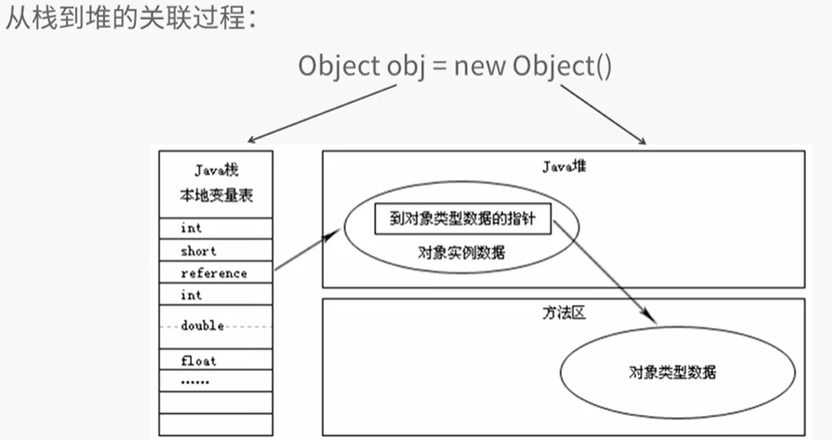

业界三大商用JVM: Oracle HotSpot、Oracle JRockit VM、IBM J9 VM

 
 #### 程序计数器 
 
 一块较小的内存空间。用来记录当前线程执行字节码所在的行号。
 如果执行的是native方法，则值为空。
 
#### Java虚拟机栈
 
 https://www.cnblogs.com/newAndHui/p/11168791.html
 
 特性：
 1. Java虚拟机栈描述的是 Java方法 的内存模型。每个方法执行的同时会创建一个栈帧。
 2. 线程私有。生命周期与线程相同。
 3. 如果线程请求的栈深度大于JVM所允许的深度会抛出StackOverflowError。当虚拟机栈允许动态扩展，如果扩展
 时，无法申请到足够的内存会抛出OutOfMemoryError。
 
 什么是栈帧？
 
   栈帧（Stack Frame）是用于支持虚拟机进行方法调用和方法执行的 #数据结构# 。
   它是虚拟机运行时数据区中的java虚拟机栈的栈元素。

　 栈帧存储了方法的局部变量表、操作数栈、动态连接和方法返回地址等信息。

   每一个方法从调用开始至执行完成的过程，都对应着一个栈帧在虚拟机里面从入栈到出栈的过程。  
  
   * 局部变量表
   是一组变量值存储空间，用于存放方法参数和方法内部定义的局部变量。存放了编译期间可知的各种基本数据类型，对象引用和
   returnAddress类型。很多人说：基本数据和对象引用存储在栈中。 正确但是不严谨。因为成员变量是存储在堆中。
   局部变量表的容量以变量槽为最小单位，每个变量槽都可以存储32位长度的内存空间。对于长度为64位的数据类型会分割成连续两次32位读写。
   
   * 操作数栈
   
   主要作用是存储计算参数、计算结果、接受方法返回的结果。
   
   一个后进先出的栈。每个栈元素称为Entry。长度由编译器根据数据类型来确定。
   
   单个Entry可以存储一个Java虚拟机定义的任意数据类型的值，包括long和double。但是long和double的深度为2，其他的为1.
   
   * 动态链接
   
   * 方法出口
   当一个方法开始执行后，只有两种方式可以退出这个方法：方法返回指令 和 异常退出。
 
#### 本地方法栈
 
 特性：
 1. 本地方法栈描述的是 Native方法 的内存模型。
 2. 线程私有。生命周期与线程相同。
 3. 如果线程请求的栈深度大于JVM所允许的深度会抛出StackOverflowError。当虚拟机栈允许动态扩展，如果扩展时，
 无法申请到足够的内存会抛出OutofMemoryError。
 
 注意：有的JVM将Java虚拟机栈和本地方法栈合二为一。
 
#### Java堆
 特性：
 1. 作用是作为Java对象的主要存储区域（存储实例数据）。
 2. 线程共享的区域。
 3. 通常是java虚拟机中最大的一块内存区域。
 4. JVMS明确要求该区域需要实现自动内存管理（GC）。
 5. 如果实际所需堆的容量超过了自动内存管理系统能提供的最大容量。会抛出OutOfMemoryError异常。
 
 堆与栈的关联：
 
 布局方式1：reference 直接指向 java堆中 对象实例数据A。A的对象头预留指针，指向方法区中对象的类型数据（Java类的结构信息：类名/字段名/方法/接口）。
 
 
 布局方式2：refrence 指向 java堆中的 句柄池。每一个句柄保存了两个数据：到对象实例数据的指针和到对象的类型数据（Java类的结构信息：类名/字段名/方法/接口）的指针。
 
 
#### 方法区和运行时常量池
 https://www.jianshu.com/p/59f98076b382

 1. 作用是存储Java类的结构信息（Java类的结构信息：类名/字段名/方法/接口）、常量、静态变量等。
 
 * 运行时常量池
 是方法区的一部分。用于存放编译期产生的各种字面量和符号引用。
 
 字面量： 文本字符串、final修饰的常量值、基本数据类型
 符号引用： 类和结构的完全限定名、字段名和修饰符、方法名和修饰符。
 
 #### 直接内存 （Direct Memory）
 直接内存不是JAVA虚拟机规范定义的内存区域。在JDK1.4中加入了NIO（New Input / Output）类，引入了一种
 基于通道和缓冲区的I/O方式。它可以使用Native函数直接分配堆外内存，然后通过一个存储在Java堆里面的DirectByteBuffer
 对象作为对这块内存的引用 从而进行操作。这样在一些场景中能显著提高性能。因为避免了在Java堆 和 Native堆中来回复制数据。
  
 
 
