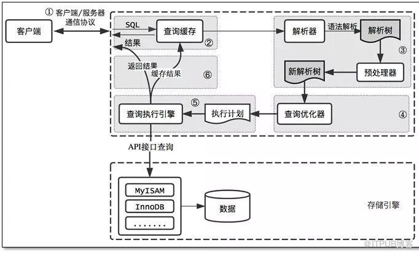

#### 数据库范式

关系数据库中的关系要满足一定的要求，不同程度的要求称为不同的范式。满足最低要求的范式称为第一范式，1NF。
在第一范式的基础上进一步满足要求的为第二范式。以此类推。

* 第一范式

所有的数据项都是不可再分的。强调的是数据的原子性。

* 第二范式

在第一范式的基础上，要求数据库表中每条记录都是可被唯一区分的。也就是每条记录有唯一标识。

* 第三方式

任何非主属性不依赖于其他非主属性。也就是A表出现的属性（主键除外）不应该出现在B表，不应该有数据冗余。

#### 数据类型

* 数值类型

1. 整数类型： tinyint（1字节）、smallint（2字节）、mediumint（3字节）、int（4字节）、bigint（8字节）。

支持指定显示宽度。如 int(5)。表示当数值宽度小于5时，数字前面填充宽度，配合zerofill使用（表示用0填充）。若数值宽度大于5，
不会有任何影响，宽度格式已没有意义。

2. 浮点数类型：float(4字节)、double（8个字节）

小数可以采用浮点数或定点数。定点数在Mysql内部以字符串存储。比浮点数更加精准。适合用来表示货币等精度高的数据。

（M,D）格式表示 （总数位,小数位）。表示一共显示M位数字，D位小数。M和D又表示精度和标度。

3. 定点数类型：decimal（M+2字节）

同2.

* 日期类型

1. date : 表示年月日

2. time： 表示时分秒

3. datetime： 表示年月日时分秒

4. year： 表示年

5. timestamp

* 字符串类型

char（M）、varchar（M）、tinytext 、text、mediumtext、longtext。

char是定长。varchar是变长。当存储的长度小于char创建时声明的长度，会用空格补充。

#### 常用函数

* 字符串函数

1. concat(s1,s2) 字符串拼接

2. lower(s) 转小写

3. upper(s) 转大写

4. trim(s) 去除行头和行尾的空格

5. substring(str,x,y) 截取在字符串str从x位置开始的y个长度

* 数值函数

1. abd(x) 返回绝对值

2. ceil(x) 返回大于x的最小整数

3. floor(x) 返回小于x的最大整数

4. rand() 返回0-1内的随机值

5. round(x,y)  返回x的四舍五入的有Y位小数的值

* 日期和时间函数

1. now() 返回当前的日期和时间

2. unix_timestamp(date) 返回date日期的unix时间戳

3. date_format(date,fmt)  按照fmt格式化date

* 流程函数

1. if(value,t,f) 如果value为真，返回t，否则返回f

2. ifnull(v1,v2) 如果v1为null，则返回v2

#### Mysql 查询过程

A.客户端发送查询请求（半双工）

B.服务端检查查询缓存，如果命中则返回存储在缓存中的结果。（命中的过程：①先检查是否有不确定函数，如now()等；②将完整的sql进行md5加密去匹配）

C.SQL解析。（通过解析器进行语法解析，生成解析树。比如检查是否用了错误的关键字或者关键字的顺序是否错误）

D.预处理。进一步检查，检查要查询的数据表或者列是否存在等，生成新的解析树。

F.生成执行计划。由查询优化器生成最优的执行计划。（执行计划是说明整个过程中要查询的表，使用的索引，查询的类型，要扫描的行数等信息）

G.mysql根据执行计划，调用存储引擎的api来执行查询。

H.结果返回客户端。

#### 存储引擎

MySQL有一个存储引擎的概念。不同的引擎有不多的特性，以满足不同场景下的需要。

比如常见的：MyISAM、InnoDB、MEMORY。

通常使用最多的是InnoDB。因为他支持事务安全的特点。

#### 索引

索引可简单分为 单列索引、组合索引、全文索引等

1. 单列索引

一个索引只包含单个列。又分为

* 普通索引：基本的索引类型，没有什么限制，允许重复值、允许空值。

* 唯一索引：不允许重复值，允许空值

* 主键索引：不允许重复值，不允许空值

2. 组合索引

一个索引包含两个以上的字段。

需要符合最左前缀原则，索引才会被使用。

3. 全文索引

在MyISAM引擎中支持。在char、varcahr、text等数据类型的字段用到。主要希望通过关键词匹配找到对应的数据行。
相比like，在数据量大的情况下，效率跟更高。

#### 存储过程 和 函数

存储过程和函数都是事先经过编译并存储在数据库中的一段sql语句集合。

调用存储过程和函数可以减少数据在数据库和应用服务器之间的传输，提高数据处理的效率。

存储过程和函数的区别在于，函数必须有返回值，而存储过程没有。存储过程参数可以使用IN、OUT、INOUT, 函数只有IN类型。

#### 视图

虚拟存在的表，在数据库中实际是不存在的，是使用时动态查询其他表生成的。

好处：

1. 视图表通常是根据条件过滤后的结果集，所以用户可以直接查询并使用。

2. 安全。可以屏蔽源表之间的关系和表结构

#### 触发器

触发器是与表有关的数据库对象，在满足条件时，触发指定的语句集。 

触发的事件可以是 insert、update、delete. 触发的时间可以是 before、after

通常用来协助应用在数据库端保证数据的完整性.

#### 分区

分区是根据一定的规则，将数据库中的表分解成多个更小的，更容易管理的部分.

对于应用而言, 逻辑上是只有一个表的存在, 但是实际的物理分区可能有多个.分区有利于管理非常大的表.

分区规则: 将分区键按照某种规则(范围区间,分区键进行hash,特定值)划分分区.

#### MySQL 主从结构

将主数据库的DDL和DML操作通过二级制日志复制到从库，然后从库对这些日志重新执行，从而使得主从数据保持同步。

优点： 
1. 如果主库出现问题，可以快速切换到从库。

2. 可以在从库执行查询操作，降低主库的访问压力。对于实时性要求高的数据仍然需要从主库查询。

二进制日志binlog有三种格式。

* statement: 基于sql语句级别的。也就是记录原始sql。

* row： 基于行级别。也就是记录每行的数据变化，不记录原始sql。日志量较statement大。

* mixed： 混合statement和row的模式。默认情况下，采用statement。某些情况会切换到row。比如语句中包含与时间有关的函数等。

