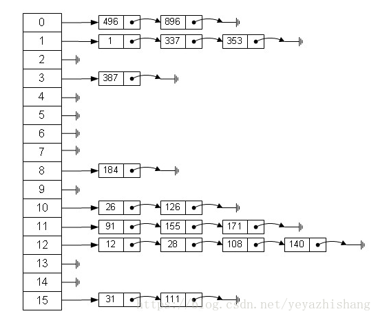

#### 概念 ####
散列表，也叫哈希表.是根据关键码和值 (key和value) 直接进行访问的数据结构，
通过key和value来映射到集合中的一个位置，这样就可以很快找到集合中的对应元素。

记录的存储位置=f(key)
这里的对应关系 f 成为散列函数，又称为哈希 (hash函数)，而散列表就是把Key
通过一个固定的算法函数既所谓的哈希函数转换成一个整型数字，然后就将该数字
对数组长度进行取余，取余结果就当作数组的下标，将value存储在以该数字为下标
的数组空间里，这种存储空间可以充分利用数组的查找优势来查找元素，
所以查找的速度很快。

哈希表在应用中也是比较常见的，就如Java中有些集合类就是借鉴了哈希原理构造的，例如HashMap，HashTable等，利用hash表的优势，
对于集合的查找元素时非常方便的，然而，因为哈希表是基于数组衍生的数据结构，在添加删除元素方面是比较慢的，
所以很多时候需要用到一种数组链表来做，也就是拉链法。拉链法是数组结合链表的一种结构，较早前的hashMap底层的存储就是采用这种结构，
直到jdk1.8之后才换成了数组加红黑树的结构，其示例图如下：（拉链法比较有效解决了哈希冲突和数组不方便增删的情况）

f(key) 散列函数/哈希函数。通常的考虑因素和设计：
* 计算哈希函数所需时间
* 关键字的分布情况...

* 直接寻址：取关键字或关键字的某个线性函数值为散列地址。即H(key)=key或H(key) = a·key + b，其中a和b为常数（这种散列函数叫做自身函数）。
若其中H(key）中已经有值了，就往下一个找，直到H(key）中没有值了，就放进去。
* 数字分析法：分析一组数据，比如一组员工的出生年月日，这时我们发现出生年月日的前几位数字大体相同，这样的话，出现冲突的几率就会很大，但是
我们发现年月日的后几位表示月份和具体日期的数字差别很大，如果用后面的数字来构成散列地址，则冲突的几率会明显降低。
因此数字分析法就是找出数字的规律，尽可能利用这些数据来构造冲突几率较低的散列地址。
*  除留余数法：取关键字被某个不大于散列表表长m的数p除后所得的余数为散列地址。
即 H(key) = key MOD p,p<=m。不仅可以对关键字直接取模，也可在折叠、平方取中等运算之后取模。
对p的选择很重要，一般取素数或m，若p选的不好，容易产生同义词。 等等...

以上方法都会造成哈希冲突。冲突的处理方法：
* 建立一个公共溢出区
* 链地址法（拉链法），jdk1.8之前有用到。拉链法比较有效解决了哈希冲突和数组不方便增删的情况

##### java 中的 HashMap #####
* HashMap的数据结构包括了初始数组、链表、红黑树。
* 插入使用pos=key%size来插入数据
* 当两个或两个以上的key（映射后的位置相等）发生冲突，就会挂在其位置的链表后。（拉链法有效解决哈希冲突和较好的提高数组增删效率）
* 当某个节点出现过多的链表节点时，就会转化成红黑树来提高效率。

java中的HashMap将在另外一篇记录。

