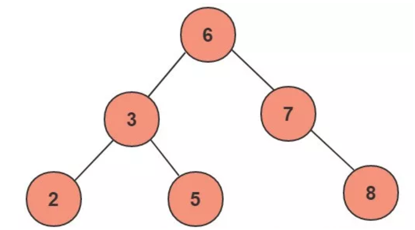

#### 概念 ####
树是一种数据结构，它是由n（n>=1）个有限节点组成一个具有层次关系的集合。把它叫做 “树” 是因为它看起来像一棵倒挂的树，也就是说它是根朝上，而叶朝下的。它具有以下的特点：
推荐链接： https://www.cnblogs.com/tiancai/p/9024351.html

* 每个节点有零个或多个子节点；
* 没有父节点的节点称为根节点；
* 每一个非根节点有且只有一个父节点；
除了根节点外，每个子节点可以分为多个不相交的子树；

###  二叉树 ###
二叉树是树的特殊一种
* 每个结点最多有两颗子树，结点的度最大为2。
* 左子树和右子树是有顺序的，次序不能颠倒。
* 即使某结点只有一个子树，也要区分左右子树。

扩展：
二叉树有很多扩展的数据结构，包括平衡二叉树、红黑树、B+树等，
这些数据结构二叉树的基础上衍生了很多的功能，在实际应用中广泛用到，
例如mysql的数据库索引结构用的就是B+树，还有HashMap的底层源码中用到了红黑树。

### 二叉查找树 ###
性质:
  * 任意节点左子树不为空,则左子树的值均小于根节点的值；
    
  * 任意节点右子树不为空,则右子树的值均大于于根节点的值；
    
  * 任意节点的左右子树也分别是二叉查找树；
    
  * 没有键值相等的节点；

上图为一个普通的二叉查找树，按照中序遍历的方式可以从小到大的顺序排序输出：2、3、5、6、7、8。

对上述二叉树进行查找，如查键值为5的记录，先找到根，其键值是6，6大于5，因此查找6的左子树，找到3；而5大于3，再找其右子树；一共找了3次。
如果按2、3、5、6、7、8的顺序来找同样需求3次。
用同样的方法在查找键值为8的这个记录，这次用了3次查找，而顺序查找需要6次。
计算平均查找次数得：顺序查找的平均查找次数为（1+2+3+4+5+6）/ 6 = 3.3次，
二叉查找树的平均查找次数为（3+3+3+2+2+1）/6=2.3次。
二叉查找树的平均查找速度比顺序查找来得更快。

局限性：同样的数据，可以对应不同结构的二叉查找树

如果我们的根节点选择了最大或最小的数据，那么二叉树就完成退化成了线性结构。二叉查找等同于
顺序查找，查找效率低下。因此若想最大性能的构造一个二叉查找树，需要这个二叉树是平衡的。
从而引出了一个新的定义-平衡二叉树AVL。

### 平衡二叉树 ###
又被称为AVL树（有别于AVL算法），且具有以下性质：
 * 一棵空树或它的左右两个子树的高度差的绝对值不超过1
 * 左右两个子树都是一棵平衡二叉树。
 
 平衡因子:
 某节点的左子树与柚子树的高度差即为该节点的平衡因子（BF,Balance Factor）。
 平衡二叉树所有节点的平衡因子只能是 -1、0、1
 公式为： 此节点往下： 左子树深度- 右子树深度 = 平衡因子
 
 
 
这个方案很好的解决了二叉查找树退化成链表的问题
推荐阅读： https://www.cnblogs.com/zhangbaochong/p/5164994.html

平衡二叉树不平衡的情形：
一般是用平衡因子差值判断是否平衡并通过旋转来实现平衡。
把需要重新平衡的结点叫做α，由于任意两个结点最多只有两个儿子，因此高度不平衡时，α结点的两颗子树的高度相差2.容易看出，这种不平衡可能出现在下面4中情况中：

1.对α的左儿子的左子树进行一次插入 (左左情形)

2.对α的左儿子的右子树进行一次插入 (左右情形)

3.对α的右儿子的左子树进行一次插入 （右左情形）

4.对α的右儿子的右子树进行一次插入 (右右情形)

情形1和情形4是关于α的镜像对称，二情形2和情形3也是关于α的镜像对称，因此理论上看只有两种情况，但编程的角度看还是四种情形。

第一种情况是插入发生在“外边”的情形（左左或右右），该情况可以通过一次 **单旋转** 完成调整；
第二种情况是插入发生在“内部”的情形（左右或右左），这种情况比较复杂，需要通过 **双旋转** 来调整。

调整措施：
#### 单旋转 ####

上图是左左的情况，k2结点不满足平衡性，它的左子树k1比右子树z深两层，k1子树中更深的是k1的左子树x，因此属于左左情况。

为了恢复平衡，我们把x上移一层，并把z下移一层，但此时实际已经超出了AVL树的性质要求。为此，重新安排结点以形成一颗等价的树。为使树恢复平衡，
我们当K2是这棵树的根节点，因为k2大于k1，把k2置于k1的右子树上，而原本在k1右子树的Y大于k1，小于k2，就把Y置于k2的左子树上，这样既满足了二叉查找树的性质，又满足了平衡二叉树的性质。
这种情况称为单旋转

#### 双旋转 ####

对于上图情况，为使树恢复平衡，我们需要进行两步，第一步，把k1作为根，进行一次右右情形的旋转，旋转之后就变成了左左情况，
所以第二步再进行一次左左情形旋转，最后得到了一棵以k2为根的平衡二叉树。

局限性：
执行插入还是删除操作，只要不满足上面的平衡二叉树的性质，就要通过旋转来保持平衡，而旋转是非常耗时的，
由此我们可以知道AVL树适合用于插入删除次数比较少，但查找多的情况。 
由于维护这种高度平衡所付出的代价比从中获得的效率收益还大，故而实际的应用不多，
更多的地方是用追求局部而不是非常严格整体平衡的红黑树。
当然，如果应用场景中对插入删除不频繁，只是对查找要求较高，那么AVL还是较优于红黑树。
