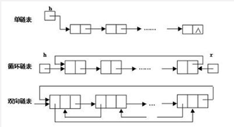

#### 概念 ####
链表是物理存储单元上非连续的、非顺序的存储结构。
数据元素的逻辑顺序通过链表的指定地址实现。每个元素包含两个节点，
一个是存储元素的数据域，另一个是指向下一个节点地址的指针域。根据指针
指向，链表能形成不同的结构，例如：单链表、循环链表。双向链表、

优点：
* 不需初始化容量，可任意增减元素，并且增加的效率快。

缺点：
* 指针域占用了额外的空间。
* 查找元素需要遍历链表，耗时严重。

适用场景：
数据量较小，需要频繁的增加和删除的场景。
