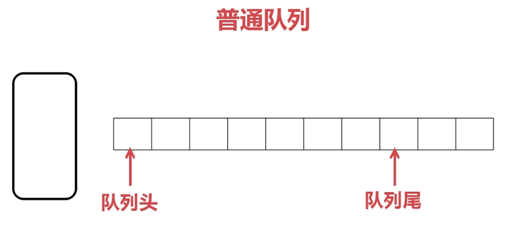
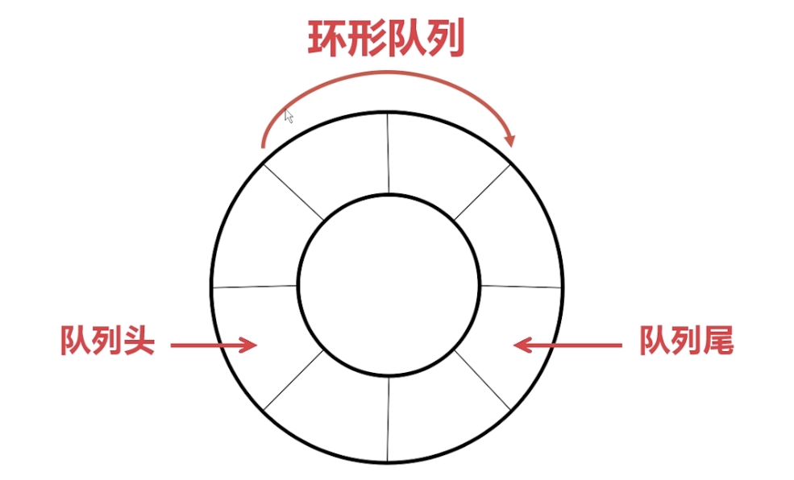

####  概念 ####
也是一种受限的线性表。在一端添加元素，另外一端取出元素。所以是先进先出。
有两种实现方式： 普通队列 和 环形队列。

##### 普通队列 ##### 

可采用数组或者顺序链表实现。该情况下，有两种出入队方式。

* 队列头每出队一个，后面的元素跟着补上。 该情况下，不会浪费内存空间。
但是每次出队后，都需要重新移动元素。

* 队列头每出队一个，队头索引跟着后移。 该情况下，不需要每次重新移动元素，
但是会浪费内存空间。
为了解决普通队列出现的问题，出现了环形队列。

##### 环形队列 #####

可采用数组或者环形链表实现。在数组实现下，重点是进行模运算。

环形队列，每次出队不需要重新移动元素，也不会浪费内存空间。
