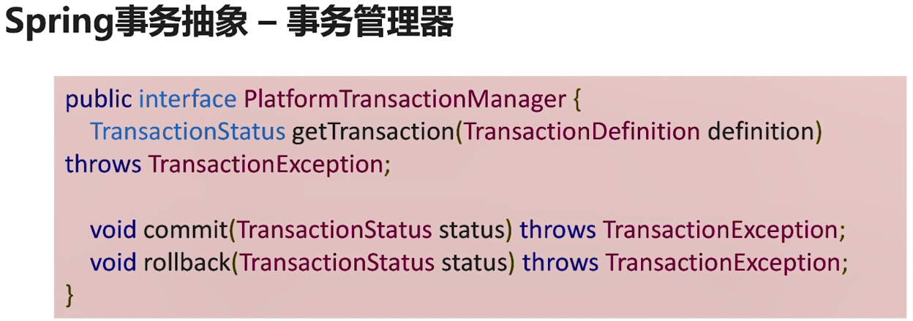
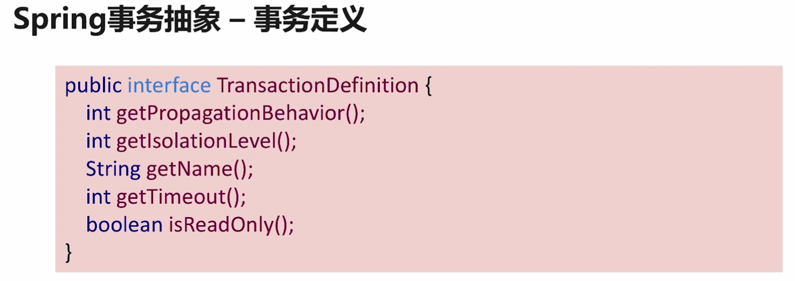
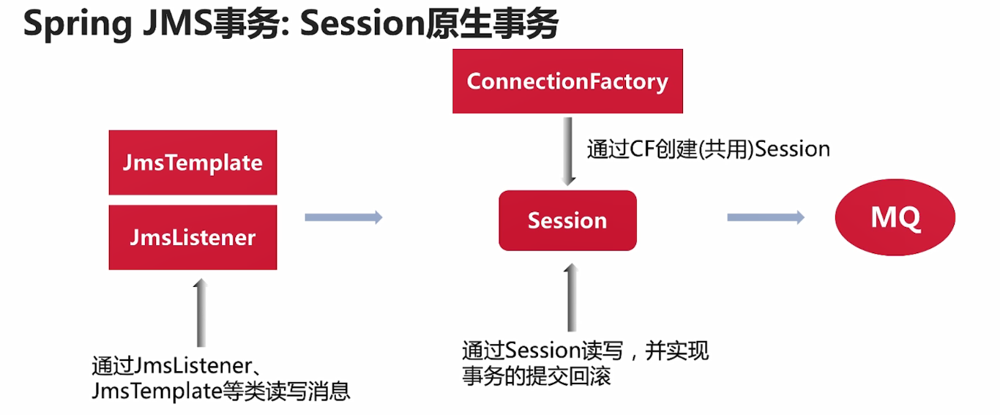
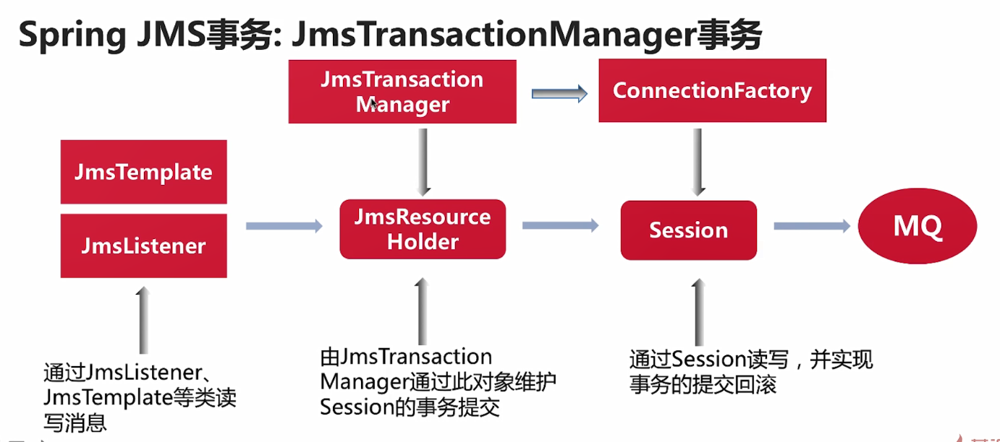
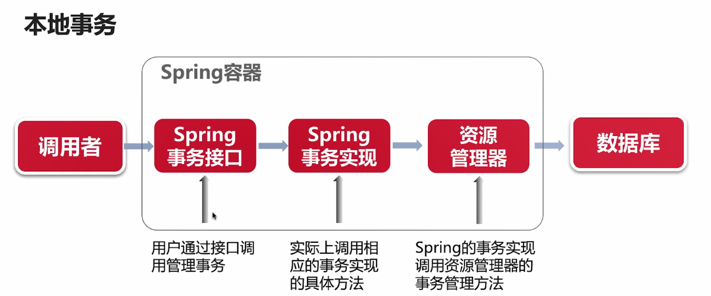
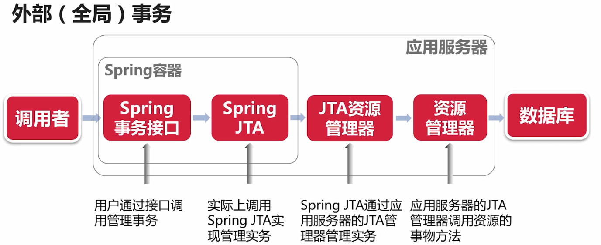
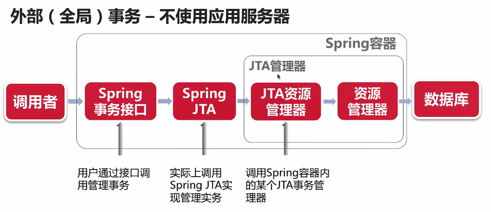

#### Spring 事务管理主要提供了什么功能？

*  提供统一的API接口对接不同的资源。

* 提供声明式事务管理。（可以以AOP，注解的方式提供，避免了和业务的耦合）

* 方便与Spring框架集成。

* 多个资源的事务管理、同步

#### Spring 事务抽象

Spring 中关于事务的主要抽象类如下.

* PlatformTransactionManager

事务管理器的接口。针对不同的数据源，可以有不同的实现 （JMS事务管理器、JTA事务管理器）

* TransctionDefinition

 事务定义。可以设置事务的传播属性、隔离属性等。后续可以根据这个定义实例对象。
 
 如图依次是： 事务传播属性、隔离级别、事务名称、事务超时时间、是否只读
 
 
 
* TranscationStatus

一个正在运行的事务的实例句柄。 

以上方法通过代码去手动管理事务。也可以通过注解的方式@Transcation。

#### Spring JMS事务

JMS(Java Message Server)Java消息服务接口，是java平台面向消息中间件的API接口。现在这说的事务针对的资源是消息服务类型。

JMS 通过 Session 进行事务控制。

Spring JMS 事务类型
* Session 管理的事务 - 原生（本地）事务

 消息类事务的操作仅限制于当前Session。

 

* 外部管理的事务 - JmsTransactionManager 
 
 使得消息类事务的操作不再限制于Session，而是整个被@Transcation修饰的方法，或者通过 PlatformTransactionManager 
 以代码的形式 控制事务。 虽然本质还是通过Session 管理事务。

 
 
 #### Spring 内部事务（本地事务）与外部事务 
 
 * 本地事务
 
 Spring容器管理事务的生命周期
 
 通过Spring事务接口调用
 
 业务代码与具体的事务实现无关
 
 
 
 
 * 外部（全局）事务
 
 外部事务管理器提供事务管理。
 
 通过Spring事务接口，调用外部事务管理器。
 
 使用JNDI等方式获取外部事务管理器的实例。
 
  * JTA 外部事务管理器
  
  外部事务管理器提供JTA事务管理
  
  JTA事务管理器可以管理多个数据资源
  
  通过两阶段提交实现多数据源的事务
  
  应用服务器提供 JTA 。例如 Jboss提供的（通过在应用服务器配置，spring 通过JNDI方式获得应用）
  
  
  非应用服务器提供 JTA。 例如：Atomikos
  
  
 
 #### XA 与 JTA
 
 JTA其实是XA规范在Java的实现。JTA的主要使用场景之一： 单个服务中多个数据源的分布式事务。
 
 JTA主要接口
 
 * TranscationManager
 
 事务管理器接口。
 
 * XAResource
 
 资源管理器接口。主要是针对多个数据源的事务接口。这个接口真正对接到具体数据源去操作对应的事务。
 
 * XID
 
 事务ID。
 
 
 JTA事务管理的弊端 
 两阶段提交导致事务时间过长，低性能，低吞吐量。
  
  
  
  
  
  
 

