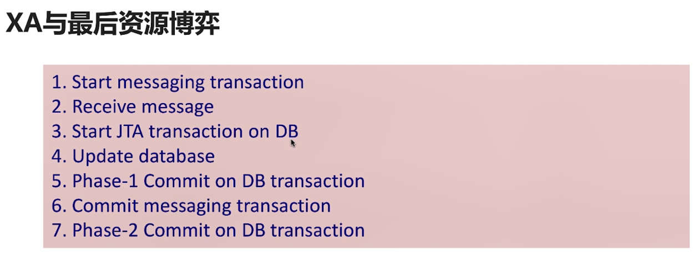
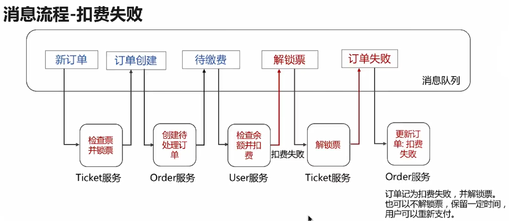
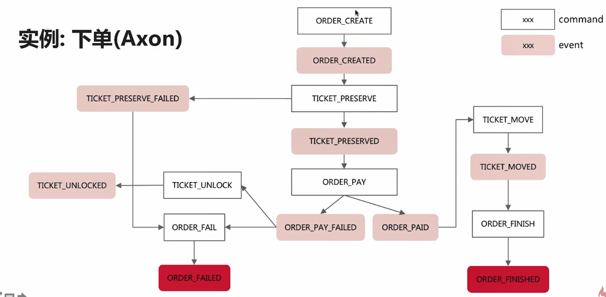

#### 什么是分布式事务？

有两种情况: 

* 单个服务中，跨不同数据源的事务就是分布式事务。

* 分布式系统中，两个不同服务的事务。

在分布式服务当中（比如微服务），服务A调用服务B。在逻辑上，数据的一致是服务A和服务B的都成功完成。服务A和服务B之间的事务如何控制？
其中一个解决方法是通过MQ。服务A发送消息到MQ，服务B进行监听，监听处理的逻辑（保存数据库，并且发送消息到mq）出现错误，
如果此时事务管理器是链式事务管理器（或者其他），那么就可以回滚（但commit阶段出错则无法回滚）。并且MQ会重新尝试读取。
此时需要考虑消费者的幂等性。


#### 分布式系统的CAP原则

* C : 一致性
* A ： 可用性
* P ： 分区容错性

#### 分布式事务的原则

分布式事务与性能存在矛盾。所以按照现实场景，划分出一致性的不同程度。

* 强一致性 ：事务的ACID都必须满足。性能上有很大的牺牲。 - 刚性事务

* 弱一致性 ：可以牺牲原子性、隔离性、只要保证数据的是完整的。可能会导致读取了事务未完成的数据。 - 柔性事务

* 最终一致性 ：只要最后保证数据是数据的一致性即可。允许出错的方法自动重试，或者 定时任务检查数据重新处理，甚至人工干预。 - 柔性事务

柔性事务是不保证事务的ACID特性，在出错后，有相应的错误处理机制去补偿，使得数据最终是一致的。

#### Spring JTA分布式事务实现

一个简单的应用: 基于消息中间件的分布式事务。 实际场景仍然是 单个服务中的多数据源下管理事务。


#### 不使用JAT的分布式实现

不使用的原因？ JTA在性能上牺牲很大，导致吞吐量低。

如果不使用JTA，那么就要保证两个或以上的数据源的事务同步。 

在不使用JTA情况下，依次提交两事务。如下： 

出现问题，当db的事务已commit，但是message事务出现异常，message事务回滚，但是db已经commit无法回滚。


在不使用JTA下，多个数据源的事务同步方法：

* XA与最后资源博弈

在两个不同数据源的事务中，其中一个实现了XA。例如图中的db使用了JTA。 db分两次提交。在message
提交后，db进行第二阶段的提交。

如果在messsage 事务提交过程中出错，那么db也能进行回滚（因为此时db是第一阶段提交）。

但是db第二阶段（最后资源）的提交任仍然可能出现错误，db事务回滚，但是message事务已经提交
无法回滚。 

这样做比起上一个场景的事务提交出错的机会会小很多。



* 最大努力一次提交 

用最大努力去做，能不能成功，不做完成保证。 但是有补偿机制。补偿可以是定时任务补偿 或 消息补偿。事务管理器可以考虑 TranscationAwareConnectionFactoryProxy
或者 ChainedTranscationManager。

消息补偿：适用于其中一个数据源是MQ，并且事务由读MQ消息开始。利用的是MQ的消息重试机制。需要考虑重复消费（幂等性）。


如图，在提交MQ事务出错后，会重试，而之前数据库已经入库一次。所以在这需要额外的逻辑
去避免重复消费。

* 链式（同步）事务

定义一个事务链，多个事务在同一个事务管理器依次提交，还是可能出错（出错的情况：事务依次提交，若某一个提交出错，已提交的无法回滚），
但是能够避免 在未commit前，出现的错误。 此时事务是没有commit，所以能回滚的。

例如 ChainedTranscationManagers，然后将各自数据源的TranscationManager加入。

举例：

数据库A的操作 updataA，数据库B的操作 updateB。若在一个service(@Transcational修饰)中

````
  updateA();
  updateB();
  throw new RuntimeException();
````
在最后抛出异常，updataA会回滚，但是updateB不会回滚。

解决方案考虑 链式事务。ChainedTranscationManager中加入数据库A的TranscationManage，数据库B的TranscationManage。

当整个service方法都正常执行时，ChainedTranscationManager依次提交A，B的事务。但是提交阶段的出错，无法回滚。
当service某处出现异常，此时还未执行到 ChainedTranscationManager，所有的数据库操作都可以执行回滚。

所以链式事务能够避免更多的出错。但是无法保证。


#### Mysql 和 Redis 的数据一致性

方案1：

更新数据：先删除缓存，再更新数据库。（若先更新数据库，再删除缓存。那么删除缓存时出错，则会导致数据不一致）

查询数据：先查询缓存，如果没有则查询数据库，再将数据保存到缓存，并返回响应。

即使更新数据时，更新数据库出现异常，事务回滚。但是在查询数据时，虽然都是旧数据，但是最起码数据是一致的。

方案2：

基于mysql的binlog同步更新redis（阿里的开源框架canal）

#### MySql 和 MQ 的数据一致性

最大努力一次提交 + 补偿机制（容错机制）

#### Mysql 和 Mysql 的数据一致性

链式事务

#### 分布式事务实现模式和技术

实现模式：

* 消息驱动模式 Message Drive： 





 1. 微服务架构的事务问题
 
 A. 服务间调用操作的回滚
 
 B. 服务间调用失败的重试问题
 
 
 问题解决：
 
 方法1： 减少服务间的调用
 
 方法2： 没有服务间调用，通过消息驱动调用服务
 
 
 消息驱动模式注意的问题：
 
 1. 消息中间件需要支持事务
 
 2. 如何处理重试的消息
 
 3. 发生异常时回滚操作
 
 
 系统错误的处理方式：
 
 方法1： 将出错未处理的消息写到失败队列，进行对应的回滚操作
 
 方法2： 通过定时任务检查超时数据（比如订单），对超时的数据进行回滚
 
 方法3： 保存出错消息，人工处理

* 事件溯源模式 Event Sourcing： 

 消息驱动模式和事件溯源模式的特点比较
 
 消息驱动中：1.事件不要求持久化保存。 2.消息只是为了 通知 更新业务数据的状态，数据库才是一等数据。 3.不要求所有的业务数据操作
 都通过消息驱动。
 
 事件溯源中：1.事件作为一等数据保存。 2.统一的事件管理器和接口，数据的更新都由事件产生。 3.数据库中数据的当前状态根据事件聚合产生。
 4.聚合数据可以保存在数据库中，也可以通过事件重新生成。
 
   
 
 优点和缺点：
 
  
  
  
  
  
  
  事件溯源和CQRS
  
  CQRS(命令查询职责分离)是一种系统实现方式。而事件溯源是基于CQRS的思想。
  
  实例
  
  
  
  
  
  
  使用Axon框架实现事件溯源模式的微服务实例
  
  1. Axon框架介绍
  
  1.1 是一个实现事件溯源和CQRS模式的框架
  
  1.2 实现了命令、事件的分发、处理、聚合、查询、存储
  
  1.3 提供注解式开发，易维护，并提供了与SpringBoot的集成。
  
  1.4 提供Command和Event
  
  1.5 可拓展，可用于分布式环境，如Spring Cloud
  
  2. Axon框架的构成
  
  2.1 聚合：Aggregate。根据某一事件聚合成最新的业务数据状态。
  
  2.2 聚合资源库：Repository 。根据提供的CommandId去Event Store查询。
  
  2.3 Command:Command Bus 和 Command Handler。Command产生Event。
  
  2.3 Event：Event Bus 和 Event Handler 和 EventStore
  
  2.4 Sage： 基于事件的流程管理模式
  
  2.5 Query： 执行数据查询操作的特殊Command
  
  3. Axon框架的构成-可拓展性 
  
  3.1 分布式Command分发
  
  3.2 通过AMQP实现分布式Event分发和处理。
  
  4. Axon框架流程（包含Command和Event）
  
  
  
  4.1 Axon Command 处理过程
  
  
  
  
  
  4.2 Axon Event 处理过程
  
  
  
   
  
  4.3 Axon的Command和Event的区别
  
  
  
  5 Saga 模式
  
  
  
  
  
  
  5.1 Axon Sage
  
  
  
  
  
  

* TCC模式 Try-Confirm-Cancel： 

#### 幂等性

* 幂等操作：任意多次的执行所产生的影响，与一次执行的影响相同。

* 方法的幂等性: 使用同样的参数多次调用一个方法，与调用一次的结果相同。

* 接口的幂等性：参数相同的情况下，接口被重复调用，结果一致。

微服务中接口的幂等性：
 1. 重要性： 经常需要通过重试来实现分布式事务的最终一致性。
 2. GET方法不会对系统产生副作用，具有幂等性。
 3. POST、PUT、DELETE方法的实现需要满足幂等性。 
 
 例子：
 
 
 
 
 
 #### 分布式系统唯一ID：GUID
 
 作用： 
 
 1. 分布式系统的全局唯一标识
 
 2. UUID: 生成唯一ID的规范
 
 3. 用于唯一标识、处理重复消息
 
 
 * 分布式唯一性ID生成
 
 1. 数据库自增序列
 
 2. UUID
 
 3. MongoDB的ObjectID： 时间戳+机器ID+进程ID+序号
 
 4. Redis的INCR操作
 
 * 使用何种方式？通过以下方便衡量：
 
 1. 自增的ID： 考虑安全性（主要指是可以推断出来的，比如1为单位递增）、部署
 
 2. 时间有序： 便于通过ID判断创建时间(基于业务的需要，也要注意安全性)
 
 3. 考虑长度、是否数字类型、是否建索引
 
 * 分布式系统的分布式对象
 
 1. Redis: Redission库（RLock），RMap，RQueue等对象
 
 2. Zookeeper：Netflix Curator库（Lock，Queue对象）
 
 
 
 
 
