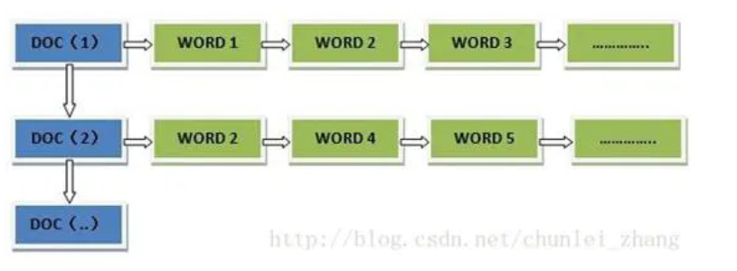
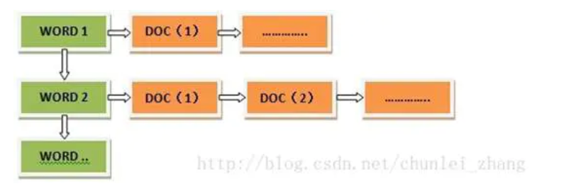

正向索引和反向索引 通常出现在搜索引擎中。搜索引擎以词（word）为单位。

##### 正向索引 #####
以文档id建立索引，对应记录表内容则是word。
在正向索引中，查询出现某个word所在的文档时,需要对所有的文档进行扫描，这种情况，
检索效率低下。但是维护索引代价并不大。

##### 反向索引 #####
以word建立索引，对应记录表内容则是出现该word的文档id和该word在文档中的位置。
检索某个关键词所在的文档效率高，但是维护索引较为复杂。

在实际应用中，搜索引擎更多的是使用反向索引。因为对用户而言，更为在意的是检索的
响应时间，而索引的维护则是在后台进行。

